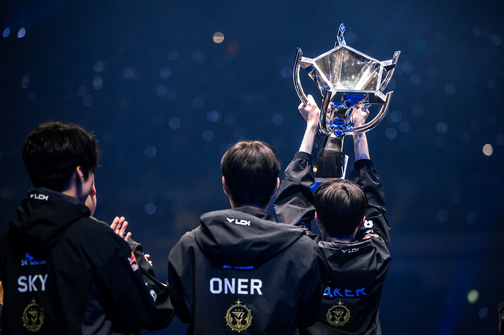
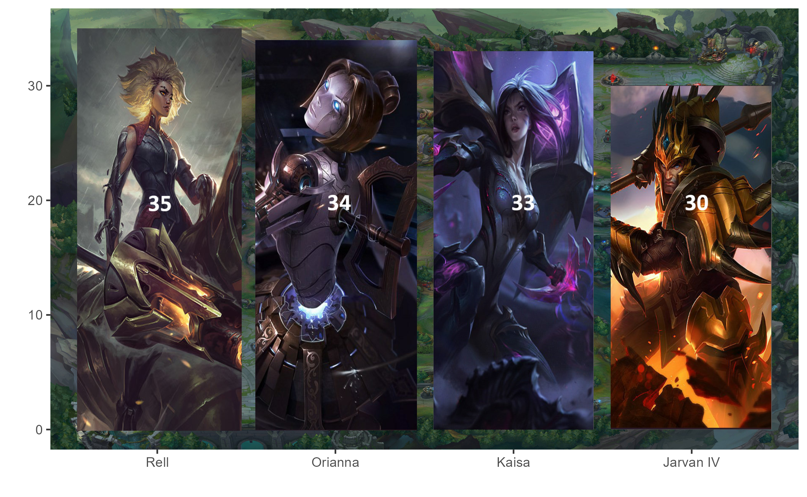

```{r setup, include=FALSE}
knitr::opts_chunk$set(echo = FALSE, warning = FALSE, message = FALSE)
```

# Gra League of Legends i E-sport: Analiza Liczb i Trendów


```{=html}
<div style="text-align: center;">
  
</div>
```


## 1. Cel Projektu:
Celem tego projektu jest przeprowadzenie analizy danych oraz zwizualizowanie odpowiednich wykresów i tabel związanych z grą **League of Legends** w celu zrozumienia trendów w liczbie graczy na przestrzeni lat oraz zbadania zmian i popularności w kontekście Mistrzostw Świata 2023 w porównaniu do poprzednich edycji oraz innych turniejów. Celem jest także znalezienie odpowiedzi na pytanie: Czy obserwuje się wzrost zainteresowania grą League of Legends i gatunkiem gier MOBA wśród społeczeństwa, czy też można zauważyć tendencje spadkowe w liczbie graczy?

## 2. Omawiane dane
Dane są pobierane za pomocą technik web scrapingu z renomowanych stron internetowych związanych z e-sportem, a także specjalistycznych serwisów dostarczających informacji o grze League of Legends. Obejmują one m. in. wyniki turniejów, nagrody finansowe, statystyki drużyn, jak i ogólne informacje na temat popularności i rozwoju gry.

**Strony internetowe:**

- https://lol.fandom.com/wiki/League_of_Legends_Esports_Wiki

- https://www.leagueoflegends.com/pl-pl/

- https://theglobalgaming.com/lol/player-count-region

- https://gol.gg/esports/home/

- https://mobalytics.gg/


## 3. Popularność gry League of Legends na świecie
Poniżej przedstawiona została tabela odnośnie ilości zwykłych graczy w poszczególnych latach. Danych dla roku 2022 nie zamieszczono.

```{r}
library(rvest)
library(tidyverse)
library(stringr)
library(kableExtra)

url_table <- "https://theglobalgaming.com/lol/player-count-region#total-player-count-league-of-legends-per-year"
page_table <- read_html(url_table)

table_2 <- page_table %>% 
  html_nodes("table") %>% 
  html_table() %>% 
  .[[1]]
table_2$`AVERAGE YEARLY PLAYERS` <- as.numeric(gsub("\\,", "", table_2$`AVERAGE YEARLY PLAYERS`))
table_2$`YEARLY GAIN/LOSS` <- as.numeric(gsub("\\,","", table_2$`YEARLY GAIN/LOSS`))
table_2$`YEARLY GAIN/LOSS %` <- parse_number(table_2$`YEARLY GAIN/LOSS %`)
table_2$`PEAK PLAYERS IN THE YEAR` <- as.numeric(gsub("\\,","",table_2$`PEAK PLAYERS IN THE YEAR`))
 
colnames(table_2) <- c("Rok", "Średnia ilość graczy", "Roczny wzrost/strata", "Roczny wzrost/strata %", "Szczytowa liczba graczy w roku")
  library(kableExtra)
  df1 <-  table_2 %>%
  kable("html", escape = FALSE) %>%
  kable_styling(bootstrap_options = "striped")
  df1
```

Łatwo zauważyć, że poza rokiem 2019 jest cały czas tendencja wzrostowa w stosunku do ilości graczy. Zwizualizowane zostało to na poniższym wykresie.

```{r}
library(ggplot2)
library(tidyverse)
table_2 %>% 
  ggplot(aes(x = Rok, y = `Średnia ilość graczy` ))+
  geom_bar(stat = "identity", fill = "lightpink", color = "black")+
  theme_minimal()+
  labs(title = "Średnia ilość graczy w poszczególnych latach")+
  theme(plot.title = element_text(hjust = 0.5))+
  scale_y_continuous(labels = scales::comma_format(), limits = c(0, max(table_2$`Średnia ilość graczy`) + 2e7))
```

W latach 2020-2023 nastąpił duży wzrost liczby graczy. Można wyłonić kilka czynników na to wpływających: były to czasy lockdownu (brak alternatywnych rozrywek i brak kontaktu ze znajomymi przyczyniły się do większej chęci wyboru gier online), a także wyjście popularnego serialu na Netflixie "Arcane". Od debiutu Arcane League of Legends przyciągnęło wielu nowych graczy. Według dewelopera Riot Games liczba graczy logujących się przynajmniej raz dziennie wzrosła o ponad 50% od premiery gry.

Poniżej przedstawiony został procentowy rozkład graczy ze względu na wiek.

```{r}
library(rvest)
library(tidyverse)
library(stringr)
library(kableExtra)
url_table <- "https://theglobalgaming.com/lol/average-age-player"
page_table <- read_html(url_table)

table_1 <- page_table %>% 
  html_nodes("table") %>% 
  html_table() %>% 
  .[[1]]
colnames(table_1) <- c("Wiek", "Procent wszystkich graczy")

kable(table_1, format = "html") %>%
  kable_styling(bootstrap_options = "striped", full_width = FALSE)
```

Jest to ciekawa obserwacja, ponieważ z tej tabeli wynika, że najwięcej graczy należy do grupy wiekowej 25-34. Również warto zauważyć, że grupa wiekowa 18-24 lat stanowi znaczący udział (37%) w społeczności graczy. To młodsze pokolenie, które często aktywnie uczestniczy w kulturze gier. Ich preferencje mogą wpływać na trendy w grach, a firmy gamingowe mogą skierować swoje działania marketingowe w ich stronę.
Co ciekawe kobiety stanowią tylko okolo 13% wszystkich graczy. Ale takie liczby często pojawiają się w kwestii gier online. Kobiety zazwyczaj wnoszą mniejszy wkład w całkowitą populację graczy.

Ponadto według danych z 2018 roku, średni wiek profesjonalnego gracza wynosi 21,2, a skończenie kariery gamingowej przypada średnio na wiek 25 lat. Możemy zauważyć, że profesjonalni gracze są często młodzi i ich kariery są stosunkowo krótkie. To może wynikać z intensywności środowiska e-sportowego oraz szybkości zmian w tej dziedzinie.


Poniżej w tabeli została przedstawiona ilość kont założonych w każdym regionie w 2021 roku.


```{r}
library(rvest)
library(ggplot2)
library(tidyverse)
library(ggdark)
url_table <- "https://theglobalgaming.com/lol/player-count-region#total-player-count-league-of-legends-per-year"
page_table <- read_html(url_table)

table_3 <- page_table %>% 
  html_nodes("table") %>% 
  html_table() %>% 
  .[[2]]
table_3 <- table_3 %>% 
  mutate(SERVER = SERVER,
         `NUMBER OF ACCOUNTS` = as.numeric(gsub("\\.", "",`NUMBER OF ACCOUNTS`)),
         `PLAYERS PROPORTION %` = parse_number(`PLAYERS PROPORTION %`))
table_3 <- table_3 %>% 
  head(11) %>% 
  arrange(desc(`PLAYERS PROPORTION %`))
 colnames(table_3) <- c("Serwer", "Liczba kont", "Rozkład procentowy graczy %")
 #table_3
library(kableExtra)
  df2 <-  table_3 %>%
  kable("html", escape = FALSE) %>%
  kable_styling(bootstrap_options = "striped")
  df2
```

Oczywiście nie jesteśmy w stanie przekonwertować 1:1 liczby założonych kont na realną liczbę graczy (bo w takim wypadku 40% populacji Korei Południowej to byliby gracze), bo niektórzy mają kilka kont na jednym serwerze, ale jesteśmy w stanie na podstawie tych danych określić popularność gry w danych regionach.

```{r}
wykres1 <- table_3 %>% 
  ggplot(aes(y = Serwer, x = `Rozkład procentowy graczy %`))+ 
  geom_bar(stat = "identity", fill = "lightblue", color = "black")+
  labs(title = "Rozkład ilości kont na każdym z serwerów", y = "", x = "% wszystkich kont")+
  theme_minimal()+
  theme(plot.title = element_text(hjust = 0.5))
wykres1
```

Na powyższym wykresie dobrze widać, że najwięcej graczy (nowych kont) jest na serwerze EUW (Europe West), czyli w Europie Zachodniej, a najmniej jest w Japonii. I w rzeczywistości dokładnie tak jest, takie regiony jak Europa, Ameryka Północna czy Chiny, Korea gromadzą bardzo dużo graczy, a w takich regionach jak Japonia czy Oceania jest znacznie mniej graczy.
Przekłada się to również na ilość profesjonalych graczy w danym regionie i ich wyniki na arenie międzynarodowej, ale o tym w dalszej części prezentacji.


## 4. Mistrzostwa Świata 2023


Była to trzynasta edycja Mistrzostw Świata League of Legends, corocznego międzynarodowego turnieju organizowanego przez twórcę gry, firmę Riot Games. Turniej rozpoczął się w Korei Południowej w dniu 10 października i trwał do 19 listopada.


```{r}
library(leaflet)

# Dane lokalizacji
lokacje <- data.frame(
  Nazwa = c("Play-In Stage", "Swiss Stage", "Quarterfinals", "Semifinals", "World Final"),
  Lokacja = c("LoL Park, Seoul", "KBS Arena, Seoul", "Sajik Indoor Gymnasium, Busan", "Sajik Indoor Gymnasium, Busan", "Gocheok Sky Dome, Seoul"),
  Data = c("October 10-15", "October 19-23, October 26-29", "November 2-5", "November 11-12", "November 19")
)

# Współrzędne geograficzne dla lokalizacji
wspolrzedne <- data.frame(
  Lokacja = c("LoL Park, Seoul", "KBS Arena, Seoul", "Sajik Indoor Gymnasium, Busan", "Sajik Indoor Gymnasium, Busan", "Gocheok Sky Dome, Seoul"),
  Lat = c(37.57108894507223, 37.55705873512369, 35.19260097204331, 35.19260097204331, 37.49871743730751),
  Lon = c(126.98161766765877, 126.84786419649367, 129.06101305133038, 129.06101305133038, 126.86700900726657)
)

# Łączenie danych lokalizacyjnych z współrzędnymi
lokacje <- merge(lokacje, wspolrzedne, by = "Lokacja")

# Tworzenie mapy
mapa <- leaflet(lokacje) %>%
  addTiles() %>%
  addMarkers(lng = ~Lon, lat = ~Lat, popup = ~paste(Nazwa, "<br>", Lokacja, "<br>", Data))

# Wyświetlenie mapy
mapa
```

Na powyższej mapie przedstawione zostały wszystkie lokalizacje, gdzie odbywały się mistrzostwa świata 2023.


### Wyniki mistrzostw świata 2023

W poniższej tabeli zamieszczone zostały wyniki (11 pierwszych miejsc) mistrzostw wraz z wygraną pulą pieniędzy.

```{r}
library(rvest)
library(tibble)
library(kableExtra)
library(htmltools)
library(tidyverse)

url_table <- "https://lol.fandom.com/wiki/2023_Season_World_Championship"
page_table <- read_html(url_table)

table_4 <- page_table %>% 
  html_nodes("table.wikitable2") %>% 
  html_table() %>% 
  .[[1]]

table_4 <- table_4 %>% 
  head(11)
table_4 <- table_4 %>% mutate(logo = "")

colnames(table_4) <- c("Miejsce", "Wygrana ($)", "Wygrana (%)" , "Drużyna", "")
table_4 %>%
  kbl(booktabs = T) %>%
  kable_paper("striped", full_width = F) %>%
  column_spec(5, image = spec_image(
    c("Images/T1_logo.svg.png", "Images/Weibo_Gaming_logo.png", "Images/Bilibili_Gaming_2021_full_allmode.png",
      "Images/Logo_JD_Gaming.png", "Images/60972b548b70f2cc4f3e8b66_nrg-open-graph.jpg", "Images/Gen.G_logo.png", 
      "Images/KT_Rolster_2021_teamcard_allmode.png", "Images/LNG_Esports_allmode.png", 
      "Images/Logo_DPlus_KIA.png", "Images/Fnaticlogo_square.webp", "Images/G2-Esports-2020-Logo_87bf0678-e67f-4834-8b09-e56137ffaa80.webp"), 
    80, 70)) %>% 
  row_spec(1, bold = T, color = "white", background = "gold") %>% 
  row_spec(2, bold = T, color = "white", background = "lightgrey") %>% 
  row_spec(3:4, bold = T, color = "white", background = "chocolate")
```

Mistrzem świata została koreańska drużyna T1 na czele z Fakerem, która pokonała w finale chińską drużynę Weibo Gaming 3-0. T1 wygrało mistrzostwa świata **po raz czwarty** zostając tym samym najlepszą drużyną w historii profesjonalnego League of Legends.

```{=html}
<div style="text-align: center;">
  
</div>
```


Poniżej zamieszczona została macierz korelacji dla zmiennych numerycznych przedstawiająca statystki dla tych najlepszych 11 drużyn turnieju.

```{r}
library(rvest)
library(tidyverse)
library(stringr)
library(kableExtra)

url_table <- "https://gol.gg/teams/list/season-ALL/split-ALL/tournament-Worlds%20Main%20Event%202023/"
page_table <- read_html(url_table)

table_2 <- page_table %>% 
  html_nodes("table") %>% 
  html_table() %>% 
  .[[2]]

druzyny_do_zatrzymania <- c("T1", "Weibo Gaming", "Bilibili Gaming", "JD Gaming", "NRG", "Gen.G eSports", "KT Rolster", "LNG Esports", "Dplus KIA", "Fnatic", "G2 Esports")

filtered_df <- table_2 %>%
  filter(Name %in% druzyny_do_zatrzymania)
filtered_df$`Win rate` <- parse_number(filtered_df$`Win rate`)

library(ggcorrplot)
library(dplyr)
# wybranie zmiennych numerycznych
correlation_num_variables <- select(filtered_df, c("Win rate", "K:D", "GDM", "GPM", "Kills / game", "Deaths / game", "Towers killed", "Towers lost"))

# macierz korelacji
corr_example <- round(cor(correlation_num_variables),2)

# p_mat dla macierzy korelacji
p_mat_example <- cor_pmat(correlation_num_variables)

ggcorrplot(corr = corr_example, lab = TRUE, p.mat = p_mat_example)
```

Zmienne:
- "Win rate" - Stosunek zwycięstw do wszystkich gier (w procentach)

- "K:D" - Stosunek zabójstw do śmierci

- "GDM" - Gold difference at minute 15 (Różnica w złocie po 15 minutach)

- "GPM" - Gold per minute (Złoto na minutę)

- "Kills / game" - Średnia ilość zabójstw na grę

- "Deaths / game" - Średnia ilość śmierci na grę

- "Towers killed" - Ilość zniszczonych wież

- "Towers lost" - Ilość utraconych wież 


To co możemy wywnioskować z tej macierzy korelacji to przede wszystkim to, że zmienne K:D, GDM i GPM są wysoce skorelowane ze zmienną Win rate. Przewaga we wczesnej fazie rozgrywki i dobre statystyki w grze (dużo zabójstw i mało śmierci) przekłada się na większą ilość wygranych.

Z kolei takie zmienne jak Towers Lost i Deaths / game mają wysoką ujemną korelację w stosunku do zmiennych Win rate, K:D, GDM, GPM, Towers Killed. To oznacza, że jeśli w grze drużyna traciła wieże i miała dużo śmierci, to przekładało się to na niższy stosunek wygranych, na mniejszą ilość złota we wczesnej fazie gry, na małą ilość zniszczonych wież itd. I ma to sens, ponieważ jeśli drużyna traciła wieże i miała dużo śmierci to oznacza, że przegrywała.


Poniżej został przedstawiony wykres, który pokazuje wartości K:D dla każdej z tych 11 drużyn. Ponadto możemy z niego odczytać wartości zmiennych GPM i GDM dla każdej z drużyn.

```{r}
dane2 <- filtered_df %>% 
  select(c("Name", "K:D", "GDM", "GPM"))

library(plotly)

plot_ly(data = dane2, x = ~`K:D`, y = ~Name, type = 'bar', text = ~paste("GPM: ", GPM, "<br>GDM: ", GDM), 
        hoverinfo = 'text', marker = list(color = ~`K:D`, colorscale = 'Viridis')) %>%
  layout(title = 'Wykres K:D dla Drużyn',
         yaxis = list(title = 'Drużyna'),
         xaxis = list(title = 'K:D Ratio'),
         coloraxis = list(colorbar = list(title = 'K:D')))
```

Wykres ten pokazuje jak duża dominację miała drużyna T1 na tym turnieju. Przyglądając się różnym drużynom, widzimy, że nie wszystkie mają wysokie wartości K:D Ratio. Na przykład drużyna "G2 Esports" wydaje się mieć niższy współczynnik, co może wskazywać na trudności w osiąganiu zabójstw w grze. Poza drużynami G2 i T1 wartosci K:D utrzymują się na w miarę jednakowym poziomie, czyli około 1.

### Uczestnicy z podziałem na narodowość

Poniższa grafika przedstawia uczestników mistrzostw w podziale na narodowości.

```{r}
library(rvest)
library(tidyverse)
url_table <- "https://gol.gg/players/list/season-ALL/split-ALL/tournament-Worlds%20Main%20Event%202023/"
page_table <- read_html(url_table)

table_6 <- page_table %>% 
  html_nodes("table") %>% 
  html_table() %>% 
  .[[4]]
table_6 <- table_6 %>% 
  select("Player", "Country") %>% 
  group_by(Country) %>% 
  summarise(Ilosc = n()) %>% 
  select(Country, Ilosc) %>% 
  arrange(desc(Ilosc))
```

```{r}
library(gt)

table_6 %>% 
  gt() %>% 
  cols_move_to_start(columns = Country) %>% 
  fmt_integer() %>% 
  fmt_flag(columns = Country) %>% 
  cols_label(
    Country = "Kraj",
    Ilosc = "Ilość graczy"
  )
```

Liczba 33 koreańskich graczy i 15 chińskich graczy może sugerować dominację tych dwóch krajów w świecie profesjonalnego League of Legends. Obie te nacje są znane z silnych drużyn i utalentowanych graczy w historii e-sportu. 

Niewielka liczba graczy z USA, Wietnamu i innych krajów może wskazywać na wzrost znaczenia innych regionów, chociaż wciąż nie dorównują one dominującym regionom.

A co do krajów europejskich to te statystki są logiczne. Europejskie drużyny jadące na mistrzostwa świata są złożone z różnych narodowości (kraje europejskie). Praktycznie nigdy nie ma kilku zawodników jednakowej narodowości w tej samej drużynie, jest to bardzo rzadkie zjawisko.

Dominacja Korei i Chin pokazuje również ta tabela.

```{r}
library(rvest)
library(tidyverse)
library(gt)
url_table <- "https://en.wikipedia.org/wiki/League_of_Legends_World_Championship"
page_table <- read_html(url_table)

table_11111 <- page_table %>% 
  html_nodes("table.wikitable") %>% 
  html_table() %>% 
  .[[2]]
colnames(table_11111) <- c("Region", "1. miejsce", "2. miejsce", "Suma")
table_11111$Region <- c("Korea Południowa (LCK)", "Chiny (LPL)", "Europa (LEC)", "Azja i Pacyfik (PCS)")
table_11111 %>% 
  gt()
```

W finałach mistrzostw świata w grze League of Legends Korea była aż **14 razy** i Chiny **7 razy**, gdy Europa była tylko 4 razy.

### Najczęściej wybierane postacie


```{r}
library(jpeg)
library(tidyverse)
library(rvest)
library(ggplot2)
library(grid)

img <- readJPEG("Images/7bcd106dc320cdd7ef4e905039ca2881.jpg")
url_table <- "https://gol.gg/champion/list/season-ALL/split-ALL/tournament-Worlds%20Main%20Event%202023/"
page_table <- read_html(url_table)

Champion <- c("Rell", "Orianna", "Kai'sa", "Jarvan IV")
Picks <- c(35, 34, 33, 30)

df <- data.frame(Champion = Champion, Picks = Picks)
df <- df %>% 
  arrange(desc(Picks))

postacie <- df %>% 
  ggplot(aes(x = Champion, y = Picks))+
  annotation_custom(rasterGrob(img, width = unit(1, "npc"), height = unit(1, "npc")))+
  geom_bar(stat = "identity")+
  labs(x = "", y = "")
postacie <- postacie+dark_theme_gray()
# ggsave("postacie2.png")
```


```{=html}
<div style="text-align: center;">
  
</div>
```

Z powyższej wizualizacji wynika, że najczęściej wybierane postacie to Rell - 35 razy, Orianna - 34, Kai'sa - 33 i Jarvan IV - 30. Możemy to zestawić ze statystykami z mistrzostw, które odbyły się rok wcześniej. Na mistrzostwach świata 2022, najczęściej branymi postaciami byly kolejno Azir, Sylas, Aphelios i Sejuani. Co ciekawe żadna z postaci nie pokrywa pod względem największej popularności w porównaniu do roku wcześniejszego.

Czym jest to spowodowane? Przede wszystkim tym, że każdego roku meta się zmienia. Najmocniejsze postacie i najlepsze strategie są w dużej mierze ustalone przez patche, które wychodzą średnio co dwa tygodnie i potrafią one mocno namieszać w kontekście rozgrywki.

### Ogladalność mistrzostw świata w League of Legends

```{r}
library(ggplot2)
library(tidyverse)
Rok <- c(2019, 2020, 2021, 2022, 2023)
Godziny_obejrzane <- c(137008382, 139880255, 174826794, 141943968, 147004385)
df11 <- data.frame(Rok, Godziny_obejrzane)
df11 %>% 
  ggplot(aes(x = Rok, y = Godziny_obejrzane)) +
  geom_bar(stat = "identity", fill = "lightgreen", color = "black") +
  theme_minimal() +
  labs(title = "Oglądalność mistrzostw świata na przestrzeni lat", x = "Rok", y = "Godziny obejrzane") +
  theme(plot.title = element_text(hjust = 0.5))+
  scale_y_continuous(labels = scales::comma_format(), limits = c(0, max(df11$Godziny_obejrzane) + 2e7))
```

Ten słupkowy wykres pokazuje, że oglądalność mistrzostw świata utrzymuje się stale na wysokim poziomie, gdzie najwięcej obejrzanych godzin było w **2021** roku.

Za to szczyt oglądalności finału rośnie z roku na rok. W 2023 ta liczba była równa aż **6,4** miliona. Oznacza to, że zainteresowanie grą najlepszych zawodników z całego świata jest cały czas wysokie i ludzie chcą to oglądać.

## 5. Podsumowanie

- Dane wskazują na znaczący wzrost liczby zwykłych graczy w latach 2020-2023

- Większość graczy to osoby w wieku od 18 do 34 lat, z dominacją grupy wiekowej 25-34 lat. To młodsze pokolenie stanowi istotny sektor społeczności graczy, co może wpływać na trendy w grach

- Duża dominacja Korei Południowej i Chin w liczbie graczy i ich wyniki w turniejach międzynarodowych potwierdza ich silną pozycję w światowym esporcie

- Mistrzostwa Świata 2023 przyciągnęły uwagę graczy i widzów, z szczytową oglądalnością finału wynoszącą 6,4 miliona widzów.

- Wygrana drużyny T1 i ich dominacja potwierdzają ich status jednej z najlepszych drużyn w historii League of Legends.

- E-sport utrzymuje się na wysokim poziomie popularności, z rosnącym zainteresowaniem globalnej publiczności.

**Czy League of Legends traci na popularności**

Z powyższych obserwacji wynika, że **nie**. Można nawet powiedzieć więcej, cały czas rośnie zainteresowanie grą League of Legends.

Ponadto możemy porównać ją do ilości graczy innych gier online.

- w 2022 roku gra DotA2 miała około 11 milionów aktywnych graczy,

- najbardziej popularna gra fps CS:GO miała około 26 milionów aktywnych graczy,

a gra League of Legends miała sporo ponad **100 milionów** aktywnych graczy co dowodzi, że ma ona duże znaczenie i popularność w świecie gamingu.


Pomimo wzrostu popularności, wyzwaniem dla przemysłu esportowego może być utrzymanie stałego zainteresowania i przyciąganie nowych graczy. Dążenie do zrównoważonego wzrostu w różnych regionach może wymagać bardziej globalnych strategii marketingowych.

